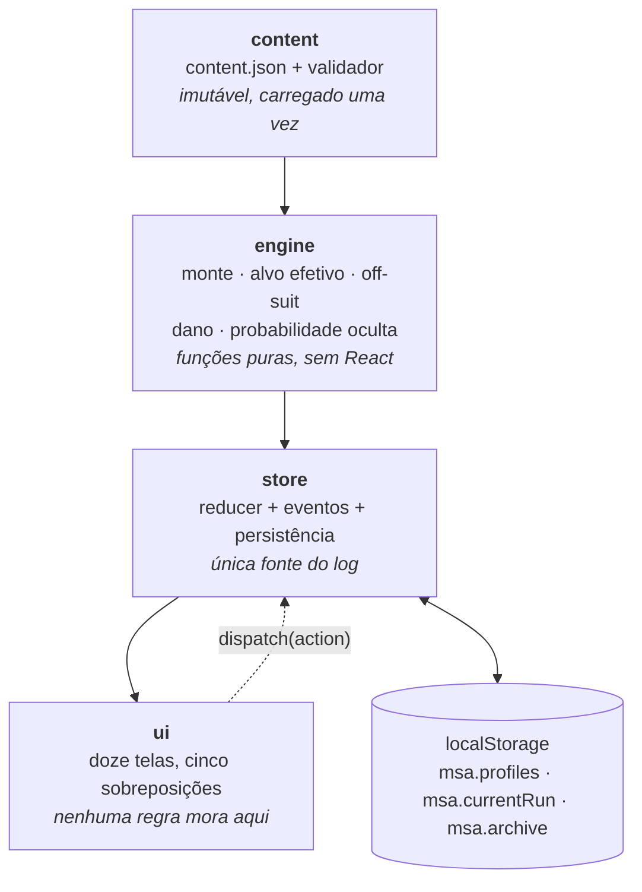
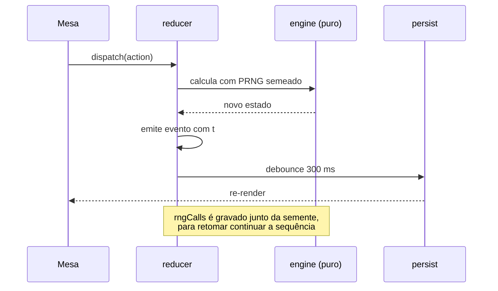
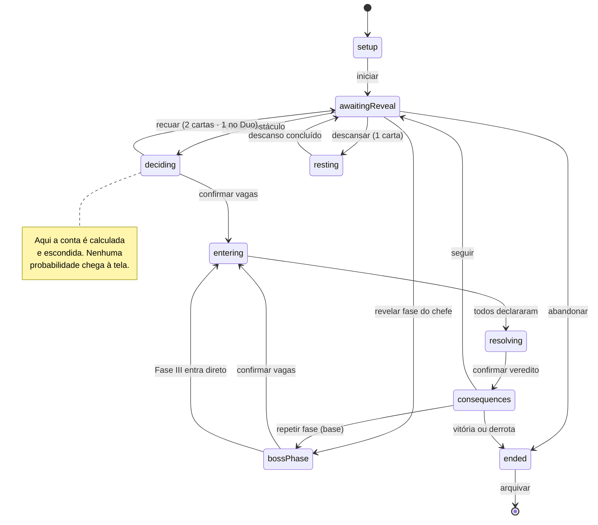
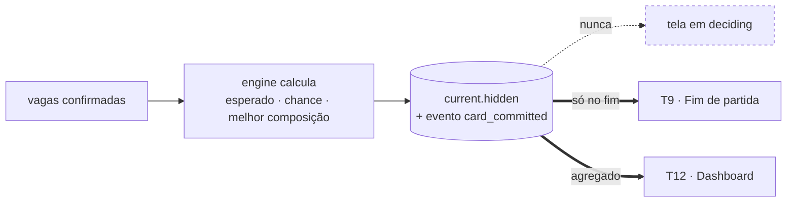

# Arquitetura

## As camadas

Cada camada só pode importar as que estão acima dela. O engine não conhece
React; a interface não conhece regra de jogo.

## O fluxo de uma ação

A regra dura: nenhuma ação escreve no log direto da interface. Se um evento não
nasce do reducer, ele não existe — é assim que o log não fica com buraco quando
alguém recarrega a página no meio de uma rodada.

## A máquina de estados

Nove estados. O campo `run.phase` governa o que a Mesa mostra e o que ela
aceita; toda transição emite evento.

Guardas: `deciding → entering` exige ao menos uma vaga ocupada; ao entrar em
`entering` as vagas travam, porque depois de rolar não há recuo. Derrota é
verificada ao sair de `consequences`: monte vazio antes de a Fase III fechar,
todos caídos, ou 3 Fúrias no Duo.

## O que a mesa não vê

A conta existe desde o commit das vagas e não chega à árvore de render antes de
`ended`. Um teste renderiza a Mesa em `deciding` e falha se o DOM contiver `%`,
"chance", "esperado" ou "sugest" — a regra fica verificada, não combinada.
